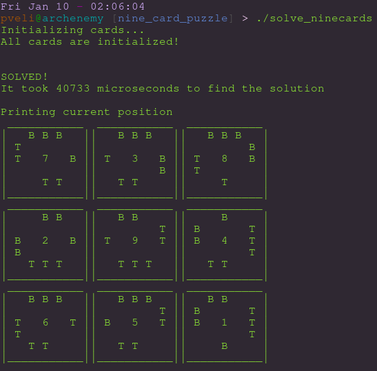

# Nine card puzzle solver

I got a souvenir which I was unable to solve by hand. Luckily a computer can do the work for me ;)

The game has 9 cards which each has top and bottom halves of a glass on four sides. The tops and bottoms align nicely when cards are inserted correctly

### The program

I made the solver in C++ because it's quite fast language to perform recurrent tasks. The program assumes that one of the cards will go to the UP-LEFT corner in some way and it has "neighbor" card to the right of it.

The program tests all the possible neighbors for the single cards, then all the possible continuations to all of the possible pairs. Once a card is placed to the edge of the 3x3 grid, it places the next one below the first cards.

In the best case scenario the program should only find one 3x3 configuration which is the correct one. However there is still some bug lying in the code which denies that wonder from me. In any case it is good enough that the correct 3x3 configuration is found in the found <i>possible</i> configurations.

