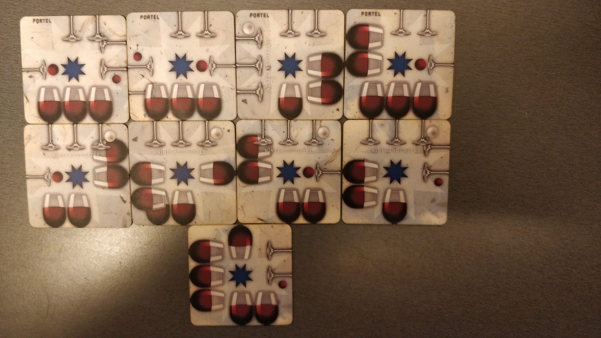

# Nine card puzzle solver

I got a souvenir which I was unable to solve by hand. Luckily a computer can do the work for me ;)

The game has 9 cards which each has top and bottom halves of a glass on four sides. The tops and bottoms align nicely when cards are inserted correctly

### The program

I made the solver in C++ because it's quite fast language to perform recurrent tasks. The program assumes that one of the cards will go to the UP-LEFT corner in some way and it has "neighbor" card to the right of it.

The program tests all the possible neighbors for the single cards, then all the possible continuations to all of the possible pairs. Once a card is placed to the edge of the 3x3 grid, it places the next one below the first cards.

I guess this program <i>should</i> work with another nine card puzzle as well but I have not tested it. Just change the <b><i>all_card_sides</i></b> constant values in <i>ninecards.cpp</i>. This code always uses the numbers (+-) 2, 3, 6 and 7 so just map those numbers to correspond to images in cards. The other half should be <b>+</b> and the other is <b>-</b>.

